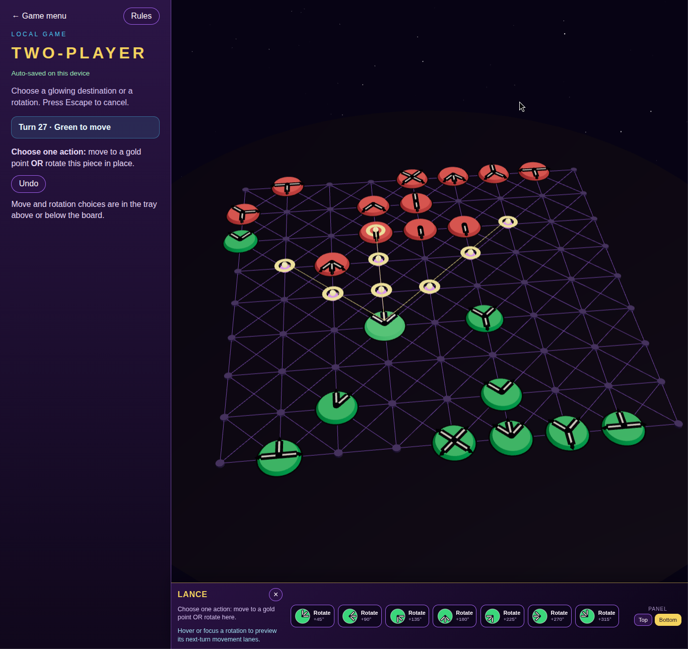
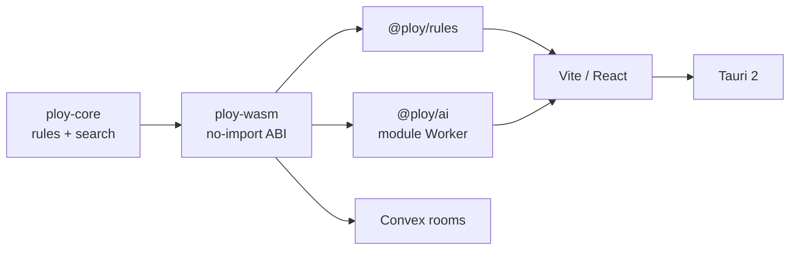

# Ploy

### A 1970 space-age strategy game, brought back to life.

I found an old copy of **Ploy** in my grandpa's basement. Its directional pieces, geometric board, and wonderfully optimistic 1970s design immediately caught my attention.

What started as curiosity about an old gem became a fascination with how much strategy was hidden inside such a simple physical system. Every piece carries its possible directions directly on its face. Moving, rotating, blocking, and capturing all emerge from that one elegant idea.

This remaster is an effort to make Ploy easier and more fun to play online, while introducing the game to a new generation of players. It preserves the original 1970 rules and rebuilds the experience as a responsive, open-source web and desktop game.

One Rust engine powers the rules and computer opponent everywhere: browser, desktop, and online rooms.

**Offline-first · No accounts · No generative AI · MIT licensed**



## Why this remaster?

Ploy has an unusually expressive ruleset: every piece's geometry determines both how it moves and how it controls the board.

This edition combines the original game with a modern implementation:

- All official modes: two-player, four-player free-for-all, and partnership
- A responsive offline computer opponent with four difficulty levels
- One authoritative Rust/WASM rules engine across every surface
- A 2.5D path-vertex board inspired by the original space-age design
- Local saves, undo, hotseat play, and keyboard interaction
- Anonymous Convex rooms without accounts
- An optional Tauri 2 desktop shell

The computer opponent is conventional game-tree search—not an LLM, neural network, or hosted model. It runs locally in a Web Worker and does not block the board.

## Project status

| Surface | Status |
| --- | --- |
| Local web play | Playable and tested |
| Two-player computer opponent | Playable: Cadet through Strategist |
| Four-player and partnership | Playable locally |
| Anonymous online rooms | Implemented; requires a Convex development environment |
| Online computer seat | Implemented with client lease and failover |
| Tauri desktop | Scaffolded; requires platform-specific Tauri libraries |
| Production deployment | Not currently provided |

The rules, WASM boundary, computer search, and web production build pass the repository test suite. Live Convex and packaged desktop releases still need platform-level release validation.

## Quick start

Requirements:

- [Bun](https://bun.sh) 1.2.22
- Rust stable through [rustup](https://rustup.rs)
- The `wasm32-unknown-unknown` Rust target

```bash
git clone https://github.com/J0nrages/Ploy.git
cd Ploy

rustup component add rustfmt clippy
rustup target add wasm32-unknown-unknown

bun install --frozen-lockfile
bun run build:wasm
bun run dev
```

Open the Vite URL printed in the terminal. Local games and the computer opponent do not require Convex or an internet connection.

## How Ploy works

Every piece carries one or more directional indicators. On a turn, choose one action:

1. Move a piece along one of its indicated straight paths.
2. Rotate a piece by a multiple of 45°.

Lances move up to three spaces, Probes up to two, and Commanders and Shields one. Pieces block movement, and an opposing piece is captured by landing on its position.

Shields are special: after moving, a Shield may also rotate as part of the same turn.

A player is defeated when their Commander is captured or they lose all their Lances, Probes, and Shields. Free-for-all and partnership games apply the continuation and takeover rules printed in the original 1970 instructions.

The in-game rules panel explains piece geometry and controls during play.

## Computer opponent

The opponent runs entirely inside the Rust/WASM core using the same move generator and terminal rules as human play.

It uses:

- Iterative deepening and MTD(f)/alpha-beta search
- Zobrist position hashing
- A transposition table
- Refutation and history move ordering
- Bounded recapture and Commander-threat extensions
- Capture quiescence
- Deterministic node budgets

| Difficulty | Character |
| --- | --- |
| Cadet | Fast, varied, and capture-biased |
| Navigator | Shallow tactical lookahead |
| Commander | Stronger balanced search |
| Strategist | Largest search budget |

Search runs in a persistent module Worker. Cancellation terminates the active Worker safely, and failed turns can be resumed without applying a partial move.

## Architecture



There is one move generator, one terminal evaluator, and one rules implementation. TypeScript handles UI, validation, serialization, and platform adapters; it does not maintain a second game engine.

```text
crates/
  ploy-core/       Rust rules and computer search
  ploy-wasm/       No-import WebAssembly boundary

packages/
  rules/           TypeScript facade over WASM
  ai/              Worker lifecycle and difficulty budgets
  ui-board/        Shared 2.5D board and interaction model

apps/
  web/             Vite and React application
  desktop/         Tauri 2 shell

convex/            Anonymous rooms and authoritative move submission
docs/              Architecture, implementation contract, and rules sources
```

## Online rooms

Local play does not construct a Convex client unless `VITE_CONVEX_URL` is configured.

To start an anonymous Convex development environment:

```bash
CONVEX_AGENT_MODE=anonymous bun x convex dev
```

Add the resulting URL to `.env.local`:

```dotenv
VITE_CONVEX_URL=your-development-url
```

Online games use six-character room codes and anonymous session identifiers. Convex validates and applies moves through the same WASM rules artifact.

Computer search never runs inside Convex. A participating browser owns a renewable lease for the computer seat and submits its selected move through the normal authoritative path. Another participant can take over if that client disappears.

Do not run a production Convex deployment unless you intend to publish one.

## Desktop

The Tauri shell uses the same web application, Worker, and WASM engine. It does not introduce native rule or search commands.

Install the appropriate [Tauri system prerequisites](https://v2.tauri.app/start/prerequisites/) before running:

```bash
bun run build:wasm
bun run dev:desktop
```

On Debian or Ubuntu, development requires packages including `pkg-config`, `libdbus-1-dev`, and WebKitGTK development libraries.

## Development

```bash
bun run build:wasm
cargo fmt --check
cargo clippy --workspace --all-targets -- -D warnings
cargo test --workspace
bun run test
bun run lint
bun run typecheck
bun run --filter web build
```

The WASM gate verifies that:

- The compiled module has no host imports
- Browser Worker and Convex adapters use identical WASM bytes
- Canonical fixture output is byte-identical
- The search engine executes inside WASM

Architecture and implementation contracts live in:

- [`AGENTS.md`](AGENTS.md)
- [`CONTEXT.md`](CONTEXT.md)
- [`docs/implementation/ploy-remaster-execution.md`](docs/implementation/ploy-remaster-execution.md)
- [`docs/adr/0001-single-rules-core.md`](docs/adr/0001-single-rules-core.md)

## Rules authority

The original 1970 3M instruction sheet is the sole authority for rules and setup:

[`Instructions - Ploy (1970 - 3M Games).png`](Instructions%20-%20Ploy%20(1970%20-%203M%20Games).png)

Secondary references do not override the printed instructions.

## Credits

Ploy was published by 3M Games in 1970.

The computer opponent is an original Rust/WASM adaptation of the search architecture documented in [Dr. Thomas Tensi's MIT-licensed Ada Ploy engine](https://tensi.eu/thomas/programming/games/ploy/ploy.html). The upstream license is preserved in [`crates/ploy-core/TENSI-LICENSE`](crates/ploy-core/TENSI-LICENSE).

This remaster uses the 1970 3M rules rather than the later partnership variants implemented by Tensi.

## License

The original software in this repository is available under the [MIT License](LICENSE).

Ploy's name, original instruction sheet, and historical artwork remain the property of their respective rights holders and are not relicensed under MIT. This is an unofficial preservation and remaster project and is not affiliated with or endorsed by 3M.
