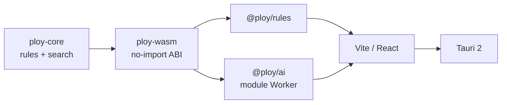

# Ploy

### A 1970 space-age strategy game, brought back to life

Ploy is an offline-first remaster of the 1970 3M bookshelf game. It preserves the printed rules while rebuilding the board, local multiplayer, and computer opponent for the web and a Tauri desktop shell.

One Rust engine powers rules and conventional game-tree search. The same no-import WebAssembly module runs in the browser Worker and desktop webview, so the UI never maintains a second rules engine.

**Offline-first · No accounts · No generative AI · MIT licensed**


## Included here

- Two-player, four-player free-for-all, and partnership modes
- Local hotseat play with auto-save and undo
- Four computer strengths and five playing styles
- Experimental adaptive local difficulty
- A responsive 2.5D board with pointer and keyboard controls
- An optional Tauri 2 desktop shell

The hosted multiplayer service is maintained in a private downstream repository. The public app’s **Play online** entry opens the unified official game at [jonathanrdaniels.com/ploy](https://jonathanrdaniels.com/ploy) in the same tab. This repository contains no hosted backend, online client implementation, deployment credentials, or private service tests. See [ADR 0003](docs/adr/0003-open-core-hosted-online-boundary.md).

## Quick start

Requirements:

- [Bun](https://bun.sh) 1.2.22
- Rust stable through [rustup](https://rustup.rs)
- The `wasm32-unknown-unknown` Rust target

```bash
git clone https://github.com/J0nrages/Ploy.git
cd Ploy

rustup component add rustfmt clippy
rustup target add wasm32-unknown-unknown

bun install --frozen-lockfile
bun run build:wasm
bun run dev
```

Local play and the computer opponent require no environment variables, hosted service, account, or internet connection.

## How Ploy works

Every piece carries one or more directional indicators. On a turn, choose one action:

1. Move a piece along one of its indicated straight paths.
2. Rotate a piece by a multiple of 45°.

Lances move up to three spaces, Probes up to two, and Commanders and Shields one. Pieces block movement, and an opposing piece is captured by landing on its position. A Shield may also rotate after moving.

Two-player armies begin with 15 pieces per color. Four-player free-for-all and partnership armies begin with 9 pieces per color. A player is defeated when their Commander is captured or they lose all their Lances, Probes, and Shields. The original instruction sheet is the sole rules authority.

## Computer opponent

The opponent uses iterative deepening, MTD(f)/alpha-beta search, Zobrist hashing, a transposition table, move ordering, bounded extensions, and capture quiescence. Strength controls the search budget and acceptable score loss; style selects among strategically close moves without overriding forced wins, avoidable losses, or Commander safety.

| Strength | Character |
| --- | --- |
| Cadet | Fast and varied |
| Navigator | Shallow tactical lookahead |
| Commander | Deeper search with small concessions |
| Strategist | Largest budget and top-scored choices |

| Style | Preference |
| --- | --- |
| Balanced | Material, mobility, safety, and threats |
| Aggressor | Captures and Commander pressure |
| Guardian | Safety, blocking, and lower risk |
| Maneuverer | Mobility, access, and reorientation |
| Trickster | Unusual rotations and threat creation |

Search runs in a persistent module Worker. Cancellation terminates the active Worker safely, and failed turns can resume without applying a partial move.

## Architecture



```text
crates/
  ploy-core/       Rust rules and computer search
  ploy-wasm/       No-import WebAssembly boundary

packages/
  rules/           TypeScript facade over WASM
  ai/              Worker lifecycle and computer profiles
  ui-board/        Shared board and interaction model

apps/
  web/             Vite and React application
  desktop/         Tauri 2 shell
```

## Desktop

Install the appropriate [Tauri system prerequisites](https://v2.tauri.app/start/prerequisites/) before running:

```bash
bun run build:wasm
bun run dev:desktop
```

## Development and acceptance

```bash
bun run wasm-gate
cargo fmt --check
cargo clippy --workspace --all-targets -- -D warnings
cargo test --workspace
bun run test
bun run lint
bun run typecheck
bun run --filter web build
cargo check --manifest-path apps/desktop/src-tauri/Cargo.toml
```

The WASM gate compiles the release artifact, verifies that it has no host imports, executes the canonical move fixture, and runs search inside the module.

Architecture and implementation contracts live in:

- [`AGENTS.md`](AGENTS.md)
- [`CONTEXT.md`](CONTEXT.md)
- [`docs/implementation/ploy-remaster-execution.md`](docs/implementation/ploy-remaster-execution.md)
- [`docs/adr/0001-single-rules-core.md`](docs/adr/0001-single-rules-core.md)
- [`docs/adr/0002-deterministic-opponent-profiles.md`](docs/adr/0002-deterministic-opponent-profiles.md)
- [`docs/adr/0003-open-core-hosted-online-boundary.md`](docs/adr/0003-open-core-hosted-online-boundary.md)

## Rules authority and credits

The original 1970 3M instruction sheet is the sole authority for rules and setup:

[`Instructions - Ploy (1970 - 3M Games).png`](Instructions%20-%20Ploy%20(1970%20-%203M%20Games).png)

Ploy was published by 3M Games in 1970. The computer opponent is an original Rust/WASM adaptation of the search architecture documented in [Dr. Thomas Tensi's MIT-licensed Ada Ploy engine](https://tensi.eu/thomas/programming/games/ploy/ploy.html). The upstream license is preserved in [`crates/ploy-core/TENSI-LICENSE`](crates/ploy-core/TENSI-LICENSE).

## License

The original software in this repository is available under the [MIT License](LICENSE).

Ploy's name, original instruction sheet, and historical artwork remain the property of their respective rights holders and are not relicensed under MIT. This is an unofficial preservation and remaster project and is not affiliated with or endorsed by 3M.
