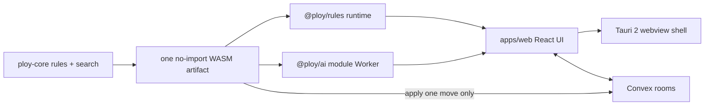

# Ploy remaster execution specification

This file is the implementation contract. It deliberately omits research history and platform rationale. The product is a Vite/React web app and a Tauri 2 desktop app using one Rust rules/search core compiled to no-import WebAssembly. The computer opponent is conventional game-tree lookahead, not a network or generative model. Convex never runs search. Two-player rooms may include a host-owned computer seat whose moves are chosen in the host client's Worker and submitted through the same `apply_move` path as a human.

## 1. Authority and fixed scope

- The sole rules authority is `Instructions - Ploy (1970 - 3M Games).png`. Wave 0 copies it byte-for-byte to `docs/rules-sources/ploy-1970-3m-instructions.png`.
- The exact setup transcription in section 4 is part of this contract. If a symbol is later found not to match the scan, stop and correct this contract before changing code.
- Modes: `twoPlayer`, `fourPlayerFfa`, and `partnership`.
- Local play: every mode as hotseat; two-player also supports a computer opponent.
- Online play: every mode, anonymous room code/invite only. Four-player and partnership seats are human-only. Two-player rooms may fill the remaining seat with a computer opponent owned by the host session.
- Identity: no accounts, Clerk, or other authentication provider in v1.
- Rotation: any non-identity resulting orientation in 45-degree increments.
- No `rotationLimit` field or alternate rotation rules in v1.
- Strict 1970 elimination. No alternate rule switches in v1.
- Visual direction: a 2.5D React Three Fiber rendering of the scan's path-vertex board, never chess-like tiles. Use domed multi-ray discs and a modern late-60s/early-70s space-age HUD in purple, coral, green, yellow, and blue. The board floats over an animated moving-space backdrop (drifting starfield and slow nebula), not a flat studio color.
- No FastAPI, PyQt, OpenSpiel, LLM, embedding, vector-search, training, or server-side opponent runtime.

## 2. Repository and ownership

```text
Ploy/
  AGENTS.md
  CONTEXT.md
  package.json
  bunfig.toml
  bun.lock
  Cargo.toml
  crates/ploy-core/
  crates/ploy-wasm/
  packages/rules/
    wasm/ploy_core.wasm
  packages/ai/
  packages/ui-board/
  apps/web/
  apps/desktop/src-tauri/
  convex/
    generated/ploy_core.wasm
    wasm.d.ts
    rooms.ts
    games.ts
  docs/adr/
  docs/rules-sources/
  archive/legacy-python/
  archive/legacy-webapp/
```

Runtime topology:



`apps/web` is the only application UI. Tauri embeds its built assets and retains the same Worker/WASM execution path. Convex is optional for local play, uses the same WASM bytes for authoritative move application, and never executes opponent search.

Only the integrator edits root manifests, root scripts, workspace membership, lockfiles, `AGENTS.md`, or shared TypeScript configuration. Run `bun install` once during bootstrap; later agents request dependency changes from the integrator. After Wave 1, agents outside the rules work order do not edit `crates/ploy-core`, `crates/ploy-wasm`, or the public `@ploy/rules` API.

Work may run in parallel only where the wave graph permits:

```text
Wave 0 -> Wave 0.5 -> Wave 1 -> +-> Wave 1B opponent --+
                                +-> Wave 2A board ------+-> Wave 3 integration
                                +-> Wave 2B online -----+
                                +-> Wave 2C desktop ----+
```

## 3. Domain and wire contract

### Coordinates and catalog

`Square` is an integer from 0 through 80 inclusive:

```ts
type Square = number; // rank * 9 + file
```

`file` is 0..8 for a..i. `rank` is 0..8 for 1..9. Rank 0 is Green's back row. `board[rank][file]` is a 9-by-9 array. Every orthogonally or diagonally adjacent vertex is connected. A motion follows one straight ray and cannot jump a piece.

Direction bits increase clockwise: N, NE, E, SE, S, SW, W, NW. `effectiveFlags = rol8(baseFlags, rot)`.

| Piece | Variant | Base mask | Range |
|---|---|---:|---:|
| Commander | - | `0x55` | 1 |
| Lance | heavy | `0x83` | 3 |
| Lance | medium | `0x45` | 3 |
| Lance | light | `0x92` | 3 |
| Probe | heavy | `0x03` | 2 |
| Probe | medium | `0x05` | 2 |
| Probe | light | `0x11` | 2 |
| Shield | - | `0x01` | 1 |

Heavy/medium/light are aliases for the shapes; the scan itself does not print those names.

### Types

```ts
type Color = "green" | "coral" | "yellow" | "blue";
type Mode = "twoPlayer" | "fourPlayerFfa" | "partnership";
type Rotation = 0 | 1 | 2 | 3 | 4 | 5 | 6 | 7;
type Team = "green-yellow" | "coral-blue";

type Piece =
  | { id: string; color: Color; controller: Color; kind: "commander"; rot: Rotation }
  | { id: string; color: Color; controller: Color; kind: "shield"; rot: Rotation }
  | {
      id: string;
      color: Color;
      controller: Color;
      kind: "lance" | "probe";
      variant: "heavy" | "medium" | "light";
      rot: Rotation;
    };

type Move =
  | { type: "motion"; from: Square; to: Square; postMoveSteps?: 1|2|3|4|5|6|7 }
  | { type: "rotate"; at: Square; steps: 1|2|3|4|5|6|7 };

type Winner =
  | { type: "color"; color: Color }
  | { type: "team"; team: Team }
  | null;

type Snapshot = {
  mode: Mode;
  board: (Piece | null)[][];
  turnSeat: Color;
  inactiveSeats: Color[];
  winner: Winner;
  ply: number;
};
```

`color` is immutable provenance and determines the rendered disc color. `controller` is the color currently allowed to move the piece. FFA takeover changes `controller`, never `color` or `id`. Partnership never changes a piece's controller.

Initial IDs use the immutable color: `{color}:{kind}{variantLetter}{n}`. Number separately within each kind/variant by low rank to high rank, then file left to right. Commanders omit the number. IDs never change.

### Moves and rotations

- A motion may land on an enemy piece but may not pass any piece.
- In two-player and FFA, friendly means equal `controller`.
- In partnership, Green/Yellow and Coral/Blue are teams. Teammates block and cannot capture one another.
- Only a Shield motion may include `postMoveSteps`. The slide and optional rotation are one move and increment `ply` once.
- Omitted `postMoveSteps` means no post-motion rotation.
- A rotation must change `effectiveFlags`.
- Generate exactly one rotation move for each distinct resulting flag mask. When multiple step counts produce the same mask, use the smallest clockwise step count. Apply the same canonicalization to Shield post-motion rotations.
- Public `applyMove` returns a new snapshot. The search engine may use private make/unmake.

### Turn seats and partnership

Turn order is Green, Coral, Yellow, Blue; two-player uses Green, Coral. `turnSeat` is the scheduled seat, not necessarily the acting color. Always advance from `turnSeat`.

`controllerForTurn(snapshot)` returns `null` after game end. Otherwise:

- Two-player: the scheduled seat.
- FFA: inactive seats are skipped.
- Partnership: if the scheduled color owns at least one piece, that color acts; if it owns no pieces, its partner acts in that slot.

Partnership does not absorb or transfer pieces. A Commanderless player with other pieces, or a bare Commander, continues to take their own turns while the game is nonterminal. A seat becomes inactive only when none of that color's pieces remain. Its partner then receives that empty seat's future turns using the partner's own pieces.

Required sequence: with Green out, the controller cycle beginning at Green's seat is Yellow, Coral, Yellow, Blue. If Coral's move removes Green's final piece, subsequent controllers are Yellow, Blue, Yellow, Coral.

### Defeat and winners

Define `strictlyDefeated(color)` as follows. In two-player and partnership, that color's Commander is absent or no Lance, Probe, or Shield of that immutable color remains. In FFA, that color's original Commander is absent or no Lance, Probe, or Shield controlled by that color remains.

- Two-player: the first strictly defeated color loses immediately.
- FFA: strict defeat makes the seat inactive. If the Commander was captured, every remaining piece controlled by that player changes controller to the capturer, including earlier takeovers. If the last controlled non-Commander was captured, remove the bare Commander. The last active color wins.
- Partnership: a team loses when both of its colors are strictly defeated. This is exactly the scan's three cases: both Commanders; all team Lances/Probes/Shields; or one opponent's Commander plus all of that opponent's partner's Lances/Probes/Shields.
- No move is accepted after `winner` is non-null.

Inspect the board, not a captured-piece bag.

### Public TypeScript API

```ts
await initializeRules(); // required once before the WASM-backed calls below

createGame(mode: Mode): Snapshot;
controllerForTurn(snapshot: Snapshot): Color | null;
sameSide(mode: Mode, a: Color, b: Color): boolean;
legalMoves(snapshot: Snapshot, color: Color): Move[];
isLegal(snapshot: Snapshot, move: Move, color: Color): boolean;
applyMove(snapshot: Snapshot, move: Move, color: Color): Snapshot;
parseSnapshot(data: unknown): Snapshot;
```

`parseSnapshot` is the side-effect-free TypeScript wire validator and is available before initialization. Calling any WASM-backed operation before initialization throws `RulesError("rulesNotInitialized")`. Rust validates the same invariants whenever a snapshot crosses the ABI. `legalMoves` returns an empty array when `color !== controllerForTurn(snapshot)`. `applyMove` throws a `RulesError`; it never returns a partially changed snapshot.

Rules error codes are `rulesNotInitialized`, `invalidSnapshot`, `invalidMove`, `notYourTurn`, `gameOver`, `noSuchPiece`, and `wrongController`.

## 4. Exact initial setups

The following is a compact transcription of the scan. Rows are rank 9 down to rank 1; columns are a through i. `.` is empty. Tokens are `{color}:{piece}{rot}`. Colors: `g` Green, `c` Coral, `y` Yellow, `b` Blue. Pieces: `C`, `LH`, `LM`, `LL`, `PH`, `PM`, `PL`, `S`.

### Two-player

```text
9  . c:LM4 c:LL4 c:LH4 c:C1  c:LH4 c:LL4 c:LM4 .
8  . .     c:PH3 c:PM3 c:PL0 c:PM3 c:PH4 .     .
7  . .     .     c:S4  c:S4  c:S4  .     .     .
6  . .     .     .     .     .     .     .     .
5  . .     .     .     .     .     .     .     .
4  . .     .     .     .     .     .     .     .
3  . .     .     g:S0  g:S0  g:S0  .     .     .
2  . .     g:PH0 g:PM7 g:PL0 g:PM7 g:PH7 .     .
1  . g:LM0 g:LL0 g:LH0 g:C1  g:LH0 g:LL0 g:LM0 .
```

### Partnership

```text
9  . c:LM4 c:C1  c:LH4 . b:LH4 b:C1  b:LM4 .
8  . c:PH3 c:PM3 c:PH4 . b:PH3 b:PM3 b:PH4 .
7  . c:S4  c:S4  c:S4  . b:S4  b:S4  b:S4  .
6  . .     .     .     . .     .     .     .
5  . .     .     .     . .     .     .     .
4  . .     .     .     . .     .     .     .
3  . g:S0  g:S0  g:S0  . y:S0  y:S0  y:S0  .
2  . g:PH0 g:PM7 g:PH7 . y:PH0 y:PM7 y:PH7 .
1  . g:LM0 g:C1  g:LH0 . y:LH0 y:C1  y:LM0 .
```

### Four-player free-for-all

```text
9  c:C0  c:LH3 c:PH4 . . . y:PH3 y:LM5 y:C0
8  c:LM3 c:PM2 c:S3  . . . y:S5  y:PM4 y:LH5
7  c:PH1 c:S3  c:S3  . . . y:S5  y:S5  y:PH6
6  .     .     .     . . . .     .     .
5  .     .     .     . . . .     .     .
4  .     .     .     . . . .     .     .
3  g:PH2 g:S1  g:S1  . . . b:S7  b:S7  b:PH5
2  g:LH1 g:PM0 g:S1  . . . b:S7  b:PM6 b:LM7
1  g:C0  g:LM1 g:PH7 . . . b:PH0 b:LH7 b:C0
```

Wave 1 writes the same tables and FEN-like rows to `docs/rules-sources/setups.md` and snapshot-tests them. Counts are 15 per two-player color (1 Commander, 6 Lances, 5 Probes, 3 Shields) and 9 per four-player color (1 Commander, 2 Lances, 3 Probes, 3 Shields).

## 5. WASM runtime contract

`ploy-core` forbids unsafe code and owns all rules, validation, move generation, terminal logic, hashing, evaluation, and search. `ploy-wasm` contains only serialization and the reviewed C ABI.

The compiled module imports nothing and exports `memory` plus these functions:

```text
ploy_alloc(len: u32) -> ptr: u32
ploy_dealloc(ptr: u32, len: u32)
create_game(ptr: u32, len: u32) -> response_ptr: u32
controller_for_turn(ptr: u32, len: u32) -> response_ptr: u32
same_side(ptr: u32, len: u32) -> response_ptr: u32
legal_moves(ptr: u32, len: u32) -> response_ptr: u32
is_legal(ptr: u32, len: u32) -> response_ptr: u32
apply_move(ptr: u32, len: u32) -> response_ptr: u32
choose_move(ptr: u32, len: u32) -> response_ptr: u32
```

A response allocation is a four-byte little-endian payload length followed by UTF-8 JSON. The host copies the payload, calls `ploy_dealloc` for the request length, and calls it for the response length plus four. Operations never retain host pointers.

Every response is one of:

```ts
type WasmResponse<T> =
  | { ok: true; value: T }
  | { ok: false; error: { code: string; message: string } };
```

External JSON is decoded into wire types and then validated into domain types. No external value is clamped. No public path panics on malformed input. The module has no clock, RNG, filesystem, network, or host callback imports.

`@ploy/rules/runtime` supplies the shared ABI adapter around an already instantiated `WebAssembly.Instance`. The browser loader, Worker, and Convex loader differ only in how they obtain the instance. The browser awaits `initializeRules` before rendering. The Worker posts `ready` after initialization. Convex imports the `.wasm` as `WebAssembly.Module`, instantiates it with `{}`, and wraps the instance with the same adapter.

`build:wasm` produces one release artifact, copies it to `packages/rules/wasm/ploy_core.wasm` and `convex/generated/ploy_core.wasm`, and verifies identical SHA-256 hashes.

## 6. Work orders

### Wave 0 — integrator bootstrap

Allowed scope: the whole repository.

1. Remove generated legacy directories only: `node_modules`, `build`, `dist`, `.venv`, and `__pycache__`.
2. Move tracked root Python source into `archive/legacy-python/`. Move the remaining source/manifests under `webapp/` into `archive/legacy-webapp/`. Preserve legacy lockfiles inside the archive; do not copy generated environments.
3. Copy the scan to `docs/rules-sources/ploy-1970-3m-instructions.png`; retain the original until acceptance.
4. Create the root Bun workspace with `"packageManager": "bun@1.2.22"`, `workspaces: ["apps/*", "packages/*"]`, `bunfig.toml` containing `[install]` and `linker = "isolated"`, one committed root `bun.lock`, TypeScript strict mode with no `any`, and scripts `dev`, `dev:desktop`, `build:wasm`, `test`, `lint`, and `typecheck`.
5. Create the Cargo workspace containing `crates/ploy-core` and `crates/ploy-wasm`; add the `wasm32-unknown-unknown` build target prerequisite to the README draft.
6. Scaffold `packages/rules`, `packages/ai`, `packages/ui-board`, and `apps/web`. Create an empty `convex/` scaffold sufficient for the spike.
7. Declare every cross-workspace dependency with `workspace:*`. Do not run npm, pnpm, or Yarn and do not create `package-lock.json`, `pnpm-lock.yaml`, `pnpm-workspace.yaml`, or `yarn.lock`.
8. Replace `.gitignore` with monorepo/Rust/Vite/Tauri/Convex ignores. Ignore `.env.local`, `.convex/`, `node_modules`, `dist`, `target`, `.venv`, and generated caches. Do not ignore `bun.lock` or the generated WASM files committed for Convex bundling.
9. Retain root `README.md` and `LICENSE`; the README is rewritten only in Wave 3.

Gate: `bun install`, scaffold typecheck, and `cargo check --workspace`. If Rust or the WASM target is unavailable, report the missing prerequisite and stop; do not substitute an engine.

### Wave 0.5 — mandatory WASM gate

Allowed scope: `crates/ploy-core`, `crates/ploy-wasm`, `packages/rules`, `apps/web/src/spike`, `convex/spike.ts`, and test/config files inside those areas. Root changes go through the integrator.

Implement a minimal legal fixture through the exact ABI from section 5. Verify:

1. `WebAssembly.Module.imports(module)` is empty.
2. Vite loads the artifact in a module Worker created with the literal `new Worker(new URL(...), { type: "module" })` form and `worker: { format: "es" }` in Vite configuration.
3. A local anonymous Convex deployment imports the same artifact and awaits `WebAssembly.instantiate(module, {})`.
4. Worker and Convex apply the same fixture and return byte-identical canonical JSON.
5. Both copied files have the same SHA-256.
6. A deterministic depth-2/3 stub benchmark records nodes/second in `docs/wasm-spike.md`.

Gate command includes `bun x convex dev --once` against an anonymous local deployment. If any runtime or parity check fails, stop. The integrator may explicitly revise the architecture to one TypeScript rules/search engine, but no agent may continue with two engines or choose a fallback implicitly.

### Wave 1 — rules core and frozen facade

Allowed scope: `crates/ploy-core`, `crates/ploy-wasm`, `packages/rules`, `docs/rules-sources/setups.md`, and their tests.

Implement catalog, setup, parsing, movement, blocking, canonical rotations, capture, FFA takeover, partnership seat substitution, turn advancement, and winner evaluation. Keep one flag table, one move generator, and one terminal evaluator. Validate snapshots for board dimensions, square bounds, unique IDs, legal colors for the mode, controller/team invariants, inactive-seat consistency, and winner consistency.

Required tests:

- Every mask, popcount, range, and setup row.
- Blocking, capture, Commander range, and friendly/partner blocking.
- Canonical rotation deduplication for every symmetric shape.
- Shield motion-plus-rotation increments one ply; non-Shields reject it.
- Two-player strict defeat and post-game rejection.
- FFA Commander capture, transitive takeover, bare-Commander removal, skipped seats, and last-active winner.
- Partnership mixed win condition, Commanderless continuation, bare-Commander continuation, zero-piece seat substitution, no recoloring/controller transfer, and the required controller sequence.
- Property tests: unique IDs, one occupied square per piece, bounds, legal move increments exactly once, illegal move is immutable, friendly capture impossible, terminal rejection, FFA takeover preserves every uncaptured piece, and partnership never changes a piece controller.
- Perft regression fixtures for initial two-player at depths 1 and 2 (depth 3 if cheap), FFA before/after takeover, and partnership continuation states. Record generated counts in the test names/output for review before freezing them.
- Native and WASM fixture outputs are canonical-byte identical.

Gate: formatting, clippy with warnings denied, all Rust tests, all `@ploy/rules` tests, and facade API review. Freeze the public API after this gate.

### Wave 1B — local two-player opponent

Allowed scope: search modules inside `crates/ploy-core`, the `choose_move` binding in `crates/ploy-wasm`, `packages/ai`, and their tests.

Implement the MIT Tensi Ada engine's search architecture in Rust/WASM: iterative deepening and MTD(f) zero-window refinement over alpha-beta, using the core move generator, make/unmake, Zobrist hashing, a transposition table, multi-entry refutation/history ordering, and a deterministic evaluation. Adapt table size and stopping controls to bounded WASM memory; do not port Tensi's rules or UI. Decode the Snapshot once before search and never call TypeScript per generated move or node. The hash covers every value that can alter two-player legality or evaluation. `choose_move` rejects non-two-player modes.

Move order is Commander captures, other captures, Tensi-style refutation/history moves, then quiet moves. Search includes bounded recapture and newly-created Commander-threat extensions plus a bounded capture quiescence search; all share the global node budget so pathological tactical lines cannot evade stopping controls. Evaluation covers terminal result, material, Commander safety, immediate Commander threats, mobility, capture opportunities, central access, exposed-Commander penalties, and rotation-only tempo. Seeded choice among near-equal scores gives Cadet and Navigator controlled variation while preserving deterministic tests.

WASM search inputs are `maxDepth`, `maxNodes`, and `randomSeed`; node count is the deterministic stopping authority. Before searching depth 1, select a legal fallback. Return the best result from the last completed depth, or the fallback at depth 0.

`packages/ai` owns a persistent module Worker. `AbortSignal` and wall time are host concerns: cancellation or watchdog expiry terminates and recreates the Worker and rejects the call; it does not pretend to return an interrupted Rust result. Difficulty presets map to calibrated node/depth budgets. Cadet is seeded capture-biased choice with a 100–200 ms host delay. Navigator targets 250–500 ms, Commander 1–2 seconds, and Strategist 3–5 seconds on the spike reference machine. These are UX targets, not WASM deadlines; deterministic node budgets remain authoritative and the watchdog is a failure ceiling.

```ts
type SearchOptions = {
  maxTimeMs: number; // Worker watchdog only
  maxDepth?: number;
  maxNodes: number;
  randomSeed: number;
};

type SearchResult = {
  move: Move;
  depth: number;
  nodes: number;
  score: number;
};

type Difficulty = "cadet" | "navigator" | "commander" | "strategist";

interface PloyBot {
  chooseMove(
    snapshot: Snapshot,
    color: Color,
    options: SearchOptions,
    signal: AbortSignal,
  ): Promise<SearchResult>;
}
```

AI errors are `unsupportedMode`, `noLegalMove`, `aborted`, `timeout`, and `engineFailure`. Preserve Tensi's MIT notice and algorithmic attribution in `crates/ploy-core/NOTICE`; do not copy its rules or UI.

Required tests: legal result, immutable input, deterministic seed, Commander capture in one, final-LPS win, avoid mate in one when savable, prefer terminal win to material, useful rotation, Shield combo, node bound, non-two-player rejection, Worker-only execution, abort/timeout recovery, and two bots completing up to 80 legal plies or reaching a terminal state without throwing.

### Wave 1C — trustworthy opponent profiles and adaptive strength

Allowed scope: search modules inside `crates/ploy-core`, the `choose_move` binding in `crates/ploy-wasm`, `packages/rules` search wire types, `packages/ai`, computer settings and diagnostics inside `apps/web`, computer-seat fields and mutations inside `convex`, domain/ADR documentation, and their tests. Existing move rules and non-computer modes remain frozen.

Opponent strength and opponent style are independent. Strength controls search budget and bounded candidate selection. Style changes evaluation preferences among strategically close moves but may not override a terminal result, an immediate forced win, an avoidable immediate defeat, or Commander safety. The initial public strengths remain Cadet, Navigator, Commander, and Strategist. The initial styles are Balanced, Aggressor, Guardian, Maneuverer, and Trickster.

Before iterative deepening, score every root move using a bounded static prepass. Search interruption retains the last fully completed depth; if depth 1 does not complete, return the best statically scored fallback rather than generator order. Return completed depth, node count, best score, selected score, score loss, fallback kind, and a principal variation. A rotation has no motion destination and never creates a false recapture extension.

One game owns one game seed. A retry or resumed turn with the same snapshot, profile revision, and seed returns the same move. A rematch retains strength and style but creates a new seed. Every mid-game opponent-profile change increments a profile revision. If a local change occurs while search is active, cancel and restart. Online computer submissions carry the revision used for search; Convex rejects an obsolete revision. Only the room host may change an online computer profile. Convex still never searches.

Local saves migrate from difficulty-only settings to a versioned opponent configuration. Existing difficulty becomes strength, style defaults to Balanced, and a generated game seed is then preserved. Undo changes board history but does not undo a manual opponent-profile change. Rematch retains the current profile.

Adaptive strength is explicit and bounded by player-selected minimum and maximum strengths. It never changes style. Balanced referee analysis evaluates qualifying human moves independently of the opponent profile. Forced moves, insufficiently completed analysis, and low-choice positions do not qualify. Adjustment uses a rolling window, requires at least four qualifying samples, changes at most one strength step, and then observes a four-turn cooldown. Referee failure skips a sample and never blocks play. Manual profile settings persist; adaptive samples at or after an undone ply are discarded before adaptive state is recomputed.

Required tests: scored fallback under first-iteration exhaustion; partial deeper iteration retains the last completed result; profile and game-seed determinism; style tactical guardrails; distinct style preferences on neutral fixtures; local v2 save migration; mid-search profile cancellation; stale online profile-revision rejection; host-only online change; rematch seed replacement; forced and low-confidence referee exclusions; bounded one-step adaptation; cooldown; undo/resume reproduction; Worker timeout recovery; and native/WASM parity.

Gate: build the committed WASM artifact, run formatting and clippy with warnings denied, all Rust and Bun tests, lint, typecheck, web build, Worker smoke, anonymous local Convex tests, and the final acceptance commands. Automatic adaptive strength ships behind an Experimental label until calibrated self-play and human review demonstrate stable level separation.

### Wave 2A — shared board UI

Allowed scope: `packages/ui-board` and its demo/tests.

Build one 2.5D React Three Fiber path-vertex board matching the 3M network, not a grid of square tiles. Use domed multi-ray discs and a modern late-60s/early-70s space-age HUD in purple, coral, green, yellow, and blue. The canvas includes an animated drifting starfield and slow nebula behind the floating path board. Include pointer and keyboard selection, legal-ray highlighting, rotation controls, a responsive camera, and a live status HUD. Stage a Shield slide in UI state and submit exactly one combined move after rotation or “no rotation.”

Gate: package build, component tests, keyboard smoke, and an interaction demo covering motion, rotation, capture, and Shield staging.

### Wave 2B — anonymous Convex rooms

Allowed scope: `convex/` and its tests. Do not edit the rules facade or generated WASM bytes.

Use `bun x convex dev` against an anonymous local deployment for development and tests. Never run `convex deploy` unless the user explicitly requests production deployment. `.env.local` may contain `VITE_CONVEX_URL` and `CONVEX_DEPLOYMENT` and remains gitignored. Add `@convex-dev/eslint-plugin`. Queries contain no wall-clock-dependent behavior, and scheduled functions, if introduced, may target only `internal.*` functions.

`convex/wasm.d.ts` is exactly:

```ts
declare module "*.wasm" {
  const mod: WebAssembly.Module;
  export default mod;
}
```

Schema:

- `rooms`: code, mode, status, hostSessionId, activeGameId, createdAt; index `by_code`.
- `seats`: roomId, color, nullable sessionId, displayName, kind (`human`|`computer`), optional difficulty, optional computer-lease owner/expiry/epoch, joinedAt, lastSeen; indexes `by_room`, `by_room_and_color`.
- `games`: roomId, validated Snapshot object, createdAt, updatedAt.
- `moves`: gameId, ply, resultingPly, move, byColor, bySessionId, requestId; indexes `by_game`, `by_game_and_requestId`.

Session IDs are high-entropy bearer secrets generated with Web Crypto and are never returned by public room, seat, game, or move queries. Public projections redact them. Display names are trimmed, nonempty, and at most 24 Unicode code points. Room codes are six characters from `ABCDEFGHJKLMNPQRSTUVWXYZ23456789`; creation checks `by_code` and rejects a collision.

Start requires every mode seat: Green/Coral for two-player and all four colors otherwise. Only the host may start or rematch. A rematch always inserts a new game and atomically updates `activeGameId`; old games and moves remain history. `getGame` follows only `activeGameId`. Two-player hosts may assign the remaining seat as `computer`. A seated human client holds a renewable 45-second lease for that computer seat; after expiry another seated human may atomically claim it. Lease ownership is redacted to an `ownedByYou` projection, and every computer submission carries the current lease epoch so a superseded client cannot move. The lease owner runs `@ploy/ai` and calls `submitMove`. Convex still applies exactly one WASM `apply_move` and never calls `choose_move`.

`submitMove` resolves the active game and checks `requestId` before `expectedPly`. A matching prior request returns its accepted resulting ply; a reused ID with different move/session/expected ply is rejected. A new request then validates expected ply, authorizes the session for `controllerForTurn`, calls one WASM `apply_move`, inserts the move, patches the game, and marks a terminal room finished in one mutation.

Use server `Date.now()` inside mutations for heartbeat/staleness. Never accept client time for authorization. In a lobby, leaving deletes the seat; stale lobby seats may be claimed after 45 seconds. After start, leaving sets that seat's session ID to null and preserves its display/color; only a null in-game seat may be claimed. If the host leaves, transfer host to the occupied seat with the lowest `joinedAt` and stable document-ID tie-break.

Gate: validator/typecheck, `convex-test` unit tests, and real anonymous local-backend tests for the WASM fixture, room-code collision, redaction, start authorization, stale expected ply, retry idempotency, request-ID misuse, partnership controller authorization, host transfer, seat reclaim, computer-lease exclusion/failover, terminal status, and exactly one active rematch.

### Wave 2C — Tauri shell

Allowed scope: `apps/desktop` only.

Create a Tauri 2 shell whose frontend source is `apps/web`. Default to offline local play. Use the same browser Worker and WASM artifact; do not add native rules/search commands.

Gate: web assets load under the Tauri CSP, Worker/WASM smoke passes, and `cargo check --manifest-path apps/desktop/src-tauri/Cargo.toml`. If the required system toolchain is absent, document the exact missing prerequisite rather than adding a second execution path.

### Wave 3 — web integration, documentation, acceptance

Allowed scope: `apps/web`, integration tests, README, and integrator-owned root files.

Integrate mode selection, local hotseat with undo, two-player human/computer color and difficulty selection, thinking/cancel/recovery UI, and online rooms including two-player human/computer seats. Construct `ConvexProvider` only when `VITE_CONVEX_URL` is nonempty. Local play must build and run with no Convex environment.

Rewrite README with prerequisites, Bun commands, web/desktop/local-Convex instructions, room flow, the three modes, 15/9-piece armies, computer difficulties, offline/no-model explanation, rules-scan credit, and Tensi MIT algorithmic attribution. Do not copy Tensi's later partnership rules.

## 7. Final acceptance

```text
bun install --frozen-lockfile
bun run build:wasm
cargo fmt --check
cargo clippy --workspace --all-targets -- -D warnings
cargo test --workspace
bun run test
bun run lint
bun run typecheck
bun run --filter web build
cargo check --manifest-path apps/desktop/src-tauri/Cargo.toml
```

Behavioral acceptance:

- Web starts every local mode with Convex unset.
- Two-player local and online computer play offers Cadet, Navigator, and Commander; Strategist may also ship.
- Search never blocks the UI thread, never runs inside Convex, and cancellation leaves the game unchanged.
- The board renders over a moving space backdrop.
- Shield motion/rotation is one move and one ply.
- Rotationally equivalent choices are deduplicated.
- Partner capture is impossible; Commanderless and bare-Commander partnership players continue while nonterminal; empty-seat substitution follows `turnSeat`.
- The mixed partnership win condition passes.
- FFA takeover is transitive without changing rendered piece colors.
- Online retries are idempotent, stale plies are rejected, secrets are redacted, and rematch has exactly one active game.
- Native, browser Worker, and real local Convex execute the same committed WASM bytes and match canonical fixture JSON.
- No generated legacy environments exist under `archive/`.
- No product dependency provides an LLM, embedding, vector search, or network opponent.
